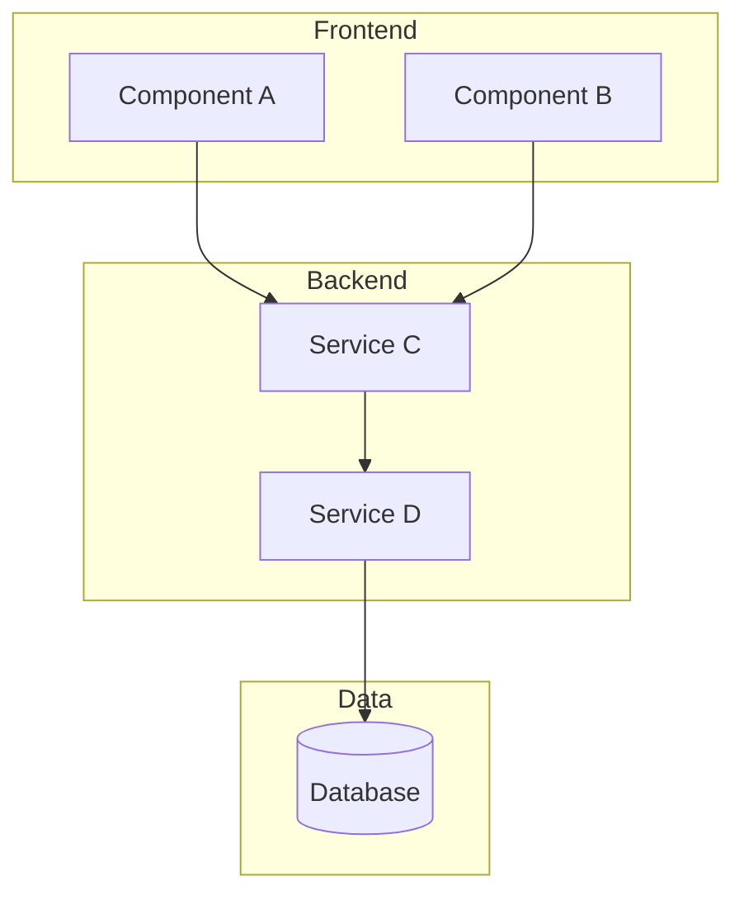
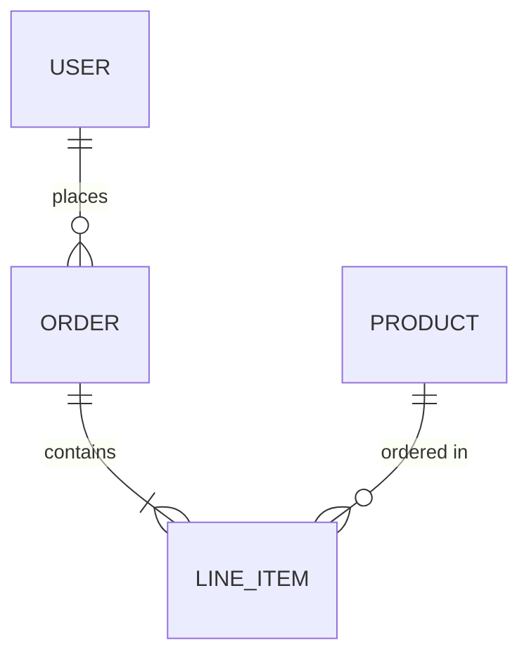
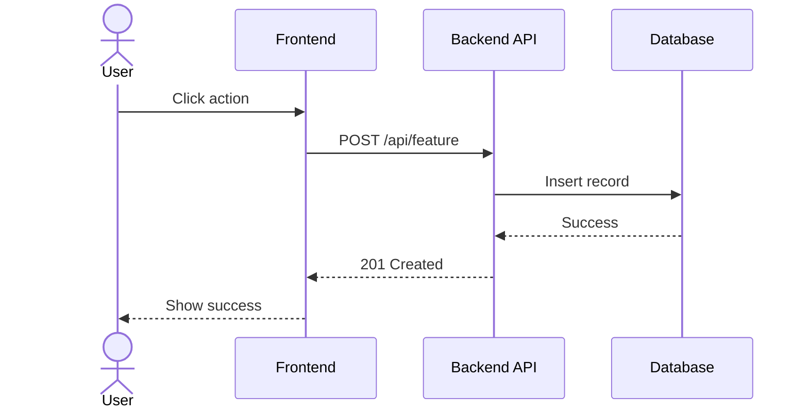
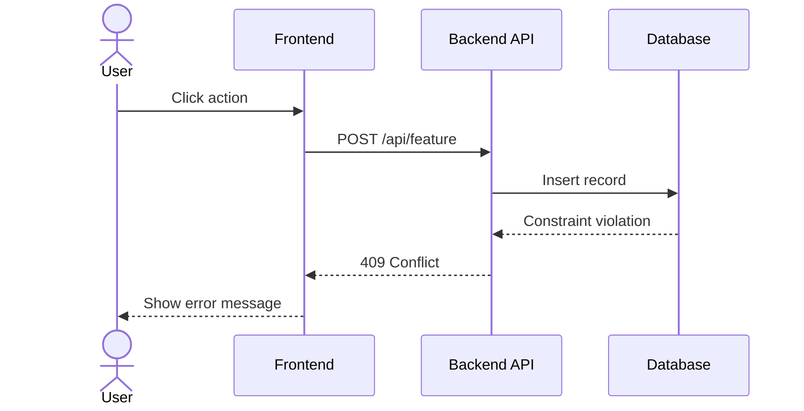
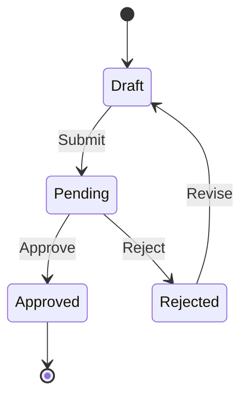

# Technical Design: [Feature Name]

**Issue:** #NNNN
**Spec:** [Link to feature spec]
**Author:** @username
**Status:** Draft | In Review | Approved
**Created:** YYYY-MM-DD

---

## 1. Overview

Brief summary of the technical approach.

---

## 2. Architecture

### Component Diagram



### Components Affected

| Component | Change Type | Description |
|-----------|-------------|-------------|
| ComponentA | New | New component for... |
| ServiceB | Modified | Add new endpoint... |
| TableC | Modified | Add columns... |

---

## 3. Data Model

### New/Modified Tables

```sql
-- New table
CREATE TABLE feature_data (
    id UUID PRIMARY KEY,
    name VARCHAR(255) NOT NULL,
    created_at TIMESTAMP DEFAULT NOW()
);

-- Modified table (add column)
ALTER TABLE existing_table ADD COLUMN new_field VARCHAR(100);
```

### Entity Relationship



---

## 4. API Design

### New Endpoints

#### POST /api/v1/feature

**Request:**
```json
{
  "name": "string",
  "options": {
    "key": "value"
  }
}
```

**Response (201 Created):**
```json
{
  "id": "uuid",
  "name": "string",
  "created_at": "ISO8601"
}
```

**Errors:**

| Code | Description |
|------|-------------|
| 400 | Invalid request body |
| 401 | Unauthorized |
| 409 | Conflict - already exists |

---

## 5. Sequence Diagrams

### Main Flow



### Error Flow



---

## 6. State Machine (if applicable)



---

## 7. Migration Strategy

### Database Migration

```sql
-- Migration: 20240115_add_feature_table.sql
-- Up
CREATE TABLE ...

-- Down
DROP TABLE ...
```

### Data Migration

1. Step 1: Backfill existing records
2. Step 2: Validate data integrity
3. Step 3: Enable new feature flag

### Rollback Plan

1. Disable feature flag
2. Run down migration
3. Deploy previous version

---

## 8. Testing Strategy

### Unit Tests
- Test new service methods
- Test validation logic

### Integration Tests
- Test API endpoints
- Test database operations

### E2E Tests
- Test complete user flow

---

## 9. Security Considerations

- [ ] Authentication required
- [ ] Authorization checks
- [ ] Input validation
- [ ] Rate limiting
- [ ] Audit logging

---

## 10. Performance Considerations

| Operation | Expected Load | Target Latency |
|-----------|---------------|----------------|
| Create | 100 req/min | < 200ms |
| Read | 1000 req/min | < 50ms |

### Caching Strategy
- Cache X at Y level with Z TTL

### Indexing
```sql
CREATE INDEX idx_feature_name ON feature_data(name);
```

---

## 11. Observability

### Metrics
- `feature_created_total` - Counter
- `feature_latency_seconds` - Histogram

### Logs
- Log at INFO level for successful operations
- Log at ERROR level with context for failures

### Alerts
- Alert if error rate > 1%
- Alert if latency p99 > 500ms

---

## 12. Implementation Plan

| Phase | Tasks | Estimate |
|-------|-------|----------|
| 1 | Database migration | 2h |
| 2 | Backend API | 4h |
| 3 | Frontend UI | 4h |
| 4 | Tests | 2h |
| 5 | Documentation | 1h |

---

## 13. Checklist

- [ ] Feature spec approved
- [ ] Technical design approved
- [ ] Database migration ready
- [ ] API implementation complete
- [ ] Frontend implementation complete
- [ ] Tests passing
- [ ] Documentation updated
- [ ] Security review (if needed)
- [ ] Performance tested
